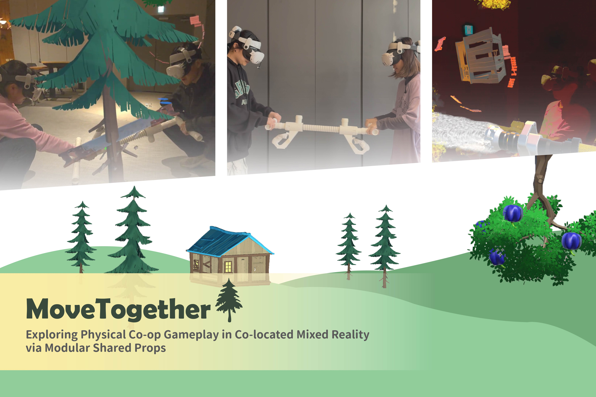
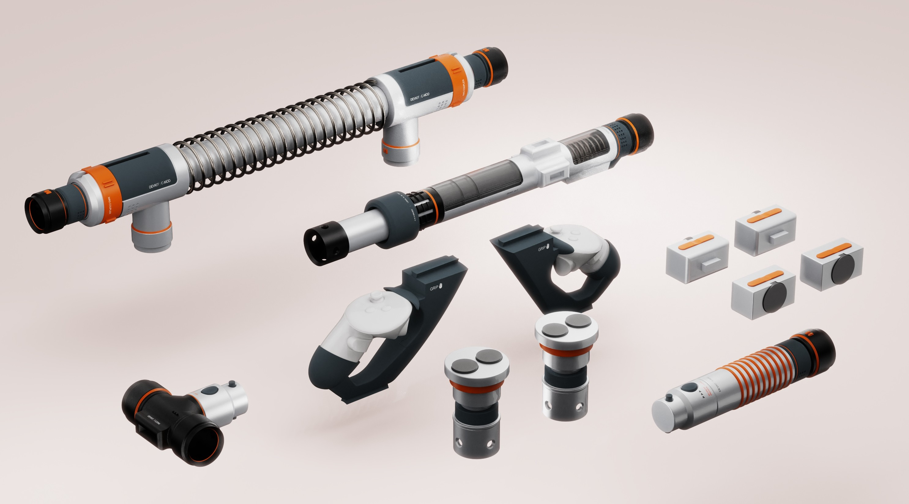
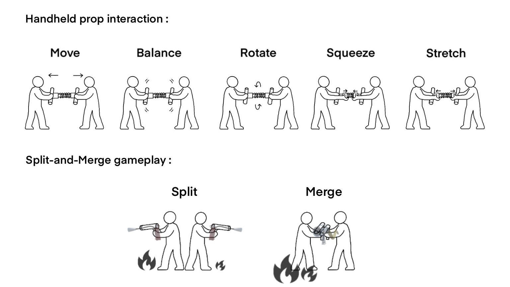
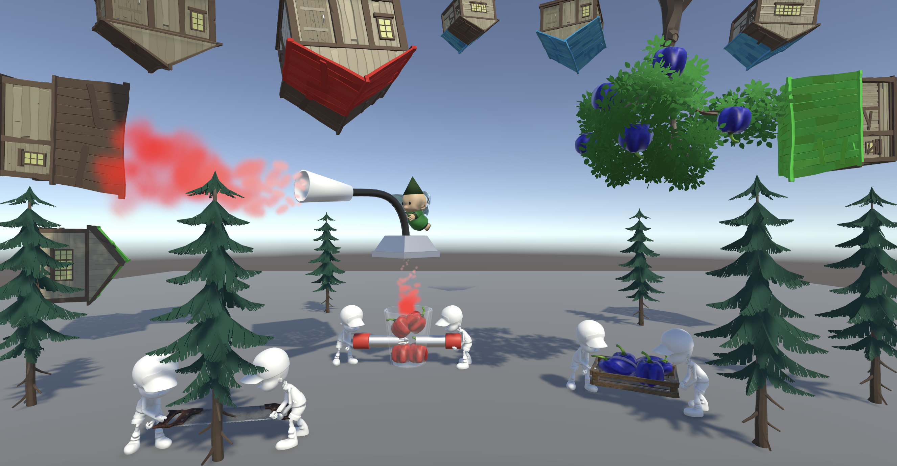

# TimberLand — MoveTogether MR Cooperative Game



*TimberLand is a co-located mixed reality cooperative game where two players jointly manipulate a modular shared prop to perform embodied physical collaboration.*

## 🪵 Overview

This repository contains the Unity implementation of **TimberLand**, a co-located mixed reality cooperative game developed as part of the research project:

> **MoveTogether: Exploring Physical Co-op Gameplay in Co-located Mixed Reality via Modular Shared Props**

TimberLand investigates how a **shared physical prop** can serve as a tangible communication channel between players, enabling embodied collaboration beyond visual and verbal cues.

Through a series of short cooperative tasks, the system demonstrates multiple forms of physical coordination, including:

- Reciprocal force coordination  
- Balance-based interaction  
- Compression-based cooperation  
- Split-and-merge collaborative play  

⚠️ **Note:**  
This repository contains only the **software implementation** of the game.  
The hardware system (*MingleKit*) and research design details are described in the paper.

## 📄 Paper

**MoveTogether: Exploring Physical Co-op Gameplay in Co-located Mixed Reality via Modular Shared Props**  
(SIGGRAPH Immersive Pavilion Submission)

Authors: Zi-Yun Lai, Shu-Chen Liu, Po-Chuan Huang, Pin-Yu Chen, Ching-I Huang, Chih-Heng Tam, Ying-Hsuan Li, Neng-Hao Yu, Mike Y. Chen

Full paper will be available upon publication.

## 🎥 Demo Video

[Watch Demo Video](https://www.youtube.com/watch?v=o7KTv_AP_bQ)

## 🧩 MingleKit Shared Prop System



MingleKit is a reconfigurable shared physical prop designed for joint manipulation by two players.

## 🤝 Interaction Modes



The shared prop serves as a tangible medium for embodied communication between players.  
Through its mechanical constraints and physical affordances, it enables multiple forms of cooperative coordination that rely on touch, resistance, and mutual force sensing.

- **Move** — Shared translation control  
- **Balance** — Stability-based coordination  
- **Rotate** — Joint orientation control  
- **Squeeze / Stretch** — Compression-based signaling  
- **Split & Merge** — Dynamic coupling and decoupling of roles

## 🎮 Gameplay Overview

<div align="center">
  
  
</div>

TimberLand follows a resource-driven progression pipeline, where each cooperative action contributes to the next stage:

- Cutting trees generates wood materials used to construct houses.  
- Catching fruits delivers raw resources to color factories.  
- Squeezing fruits produces pigments that gradually paint the houses.  
- Fires threaten the completed houses, requiring players to protect their work through dynamic split-and-merge coordination.

Through this pipeline, players must coordinate multiple physical interaction modes to build, maintain, and defend the shared environment.

### 🌲 Sawing — Reciprocal Force Cooperation

Players synchronize push–pull motions to cut trees using a shared saw configuration, generating wood materials for house construction.

### 🍎 Fruit Catching — Balance Cooperation

Players coordinate balance to catch falling fruits and deliver them into color factories.

### 🎨 Juice Squeezing — Compression-Based Cooperation

Players apply synchronized inward and outward forces to extract pigments from the fruits.  
Successful squeezing produces pigments that gradually fill and color the houses.

### 🔥 Firefighting — Split-and-Merge Cooperation

Players dynamically split the shared prop into individual extinguishers to handle scattered fires, or recombine it into a high-power hose for coordinated firefighting.

## 🖥 Requirements

- Unity **2022.3.62f3** (URP)
- Meta Quest 3
- Meta XR All-in-One SDK
- Netcode for GameObjects
- Unity Transport Package

## 🚀 Getting Started

### 1️⃣ Clone Repository

```bash
git clone https://github.com/lazumo/MR-Timberv2.git
```

### 2️⃣ Open Project

Open the project using **Unity 2022.3.62f3**.

### 3️⃣ Install Required SDKs

Install the following dependencies via Unity Package Manager:

- **Meta XR All-in-One SDK** — Install via [Unity Asset Store](https://assetstore.unity.com/packages/tools/integration/meta-xr-all-in-one-sdk-269657)
- **Netcode for GameObjects** — Unity Registry
- **Unity Transport Package** — Required for networking support

### 4️⃣ Load Main Scene

Load the main scene: `Assets/Scenes/ControllerScene.unity`

### 5️⃣ Build to Quest

- Switch platform to Android
- Connect Meta Quest 3
- Build & Run

## 📂 Repository Structure

```
Assets/
├── Script/      Game logic and interaction code
├── Prefab/      Networked game objects
└── Scenes/      Main gameplay scenes
```

## ⚙️ Implementation Highlights

- A single modular shared physical prop supports multiple cooperative interaction modes within one mixed reality game.
- Tight integration between physical constraints and virtual gameplay mechanics enables embodied communication, coordination, and dynamic role negotiation.

## 📜 License

This project is intended for academic research use only.

## 📖 Citation

If you use this work in academic publications, please cite:

*(BibTeX will be added after publication.)*